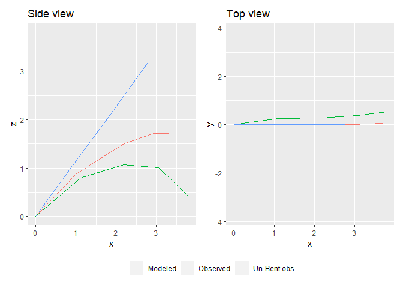
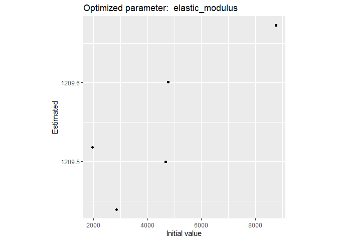
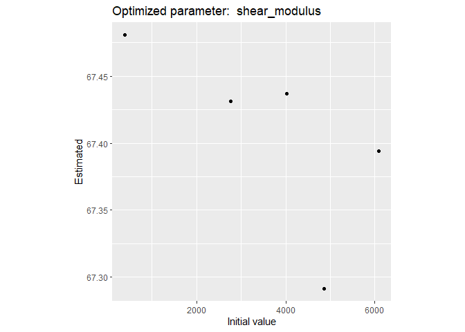
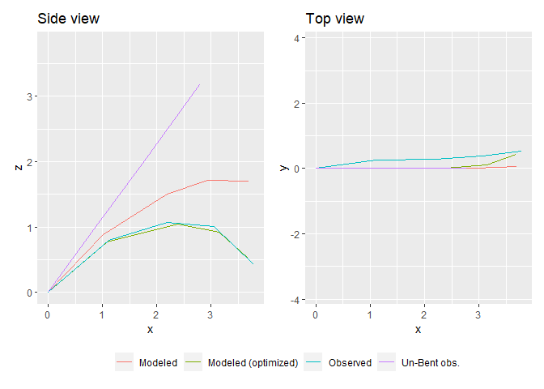

<!-- README.md is generated from README.Rmd. Please edit that file -->

# biomech

<!-- badges: start -->

[](https://github.com/PalmStudio/biomech/actions)
<!-- badges: end -->

`biomech` aims at computing bending and torsion of beams following the
Euler-Bernoulli beam theory. It is specifically designed to be applied
on tree branches (or e.g. palm leaves), but can be applied to any other
beam-shaped structure.

## Table of Contents

  - [1. Installation](#1-installation)
  - [2. Examples](#2-examples)
      - [2.1 Example field data](#21-example-field-data)
          - [2.1.1 Presentation](#211-presentation)
          - [2.1.2 Un-bending](#211-un-bending)
      - [2.2 Bending model](#22-bending-model)
      - [2.3 Plotting](#23-plotting)
      - [2.4 Optimization](#24-optimization)
      - [3. References](#3-references)

## 1\. Installation

You can install biomech from [GitHub](https://github.com/) with:

``` r
# install.packages("devtools")
devtools::install_github("PalmStudio/biomech")
```

## 2\. Examples

The bending function (`bend()`) uses two parameters: the elastic
modulus, and the shear modulus. A good introduction to these concepts is
available on
[wikipedia](https://en.wikipedia.org/wiki/Euler%E2%80%93Bernoulli_beam_theory)

In our examples, these parameters are unknown at first, but they can be
computed from field data.

### 2.1 Example field data

#### 2.1.1 Presentation

Our field data consist on measurements made along the leaf of a palm
plant. The leaf is discretized into 5 segments. each segment is defined
by a single point at the beginning of the segment representing its
cross-section, with attributes such as its dimensions (width, height)
and shape (=`type`), the distance from the last point to the current
point, the inclination and torsion at the first point, the x, y and z
positions of the point (used to cross-validate), the mass of the rachis
and of the leaflets on the right and on the left separately.

Here is a little depiction of the information:


See (Perez 2017) for more information about the subject.

The example field data is available from the package and can be read
using:

``` r
library(biomech)
file_path = system.file("extdata/6_EW01.22_17_kanan.txt", package = "biomech")
field_data = read_mat(file_path)
```

Here is what it looks like:

    #>    distance type   width  height inclination torsion     x     y    z   mass
    #> V1     0.00    1 0.07550 0.04110        48.8       4 0.000 0.000 0.00 0.0000
    #> V2     1.34    2 0.03291 0.03030        48.8       4 1.110 0.250 0.79 1.3036
    #> V3     1.34    3 0.01810 0.02982        48.8       4 2.196 0.275 1.07 0.6466
    #> V4     0.77    4 0.01144 0.01121        48.8       4 3.056 0.380 1.01 0.1230
    #> V5     0.77    5 0.00100 0.00100        48.8       4 3.791 0.530 0.42 0.0347
    #>    mass_right mass_left
    #> V1     0.0000    0.0000
    #> V2     0.1339    0.1654
    #> V3     0.4388    0.4828
    #> V4     0.2568    0.2411
    #> V5     0.0962    0.1020

#### 2.1.2 Un-bending

We can use the field data to try our bending model. But first, it must
be “un-bent” back to a straight line. This is made using `unbend()`,
such as:

``` r
# Un-bending the field measurements:
df_unbent = unbend(field_data)
```

### 2.2 Bending model

We can use `bend()` to bend a straight beam providing initial values and
known elastic and shear modulus.

We can try it out on our example leaf data. But first, we have to
compute a variable that is missing from our `df_unbent` data.frame: the
distance of application of the mass of the leaflets on the right and
left sides of each segment. We can approximate this using a sine
function:

``` r
# Adding the distance of application of the left and right weight (leaflets):
df_unbent$distance_application = distance_weight_sine(df_unbent$x)
```

Know we’re ready to go with our model, using some expert knowledge to
estimate the elastic and shear modulus:

``` r
# (Re-)computing the deformation:
df_bent = bend(df_unbent, elastic_modulus = 2000, shear_modulus = 400)
#>  Final torsion angle at the tip (degree) =  12.52822
```

### 2.3 Plotting

We can now plot the results using `plot_bending()`. We want to compare
the observed data with the simulated data. We also want to check if the
straight line was right. Let’s put all three on a single plot:

``` r
plot_bending(Observed = field_data, "Un-Bent obs." = df_unbent, Modeled = df_bent)
```



We can even make a 3d plots using `plot_bent_3d()`:

``` r
plot_bending_3d(Observed = field_data, "Un-Bent obs." = df_unbent, Modeled = df_bent)
```


OK, not bad. But the adjustment is not really that close to the
measurement.

### 2.4 Optimization

`optimize_bend()` can help us find out the right values for both our
parameters:

``` r
params = optimize_bend(field_data, type = "all")
#> Maximum torsion angle (degree) =  21.23896(!) Hypothesis of small displacements not verified for TORSION(!)Maximum torsion angle (degree) =  66.05235(!) Hypothesis of small displacements not verified for TORSION(!)Maximum torsion angle (degree) =  59.79778(!) Hypothesis of small displacements not verified for TORSION(!)Maximum torsion angle (degree) =  46.09996(!) Hypothesis of small displacements not verified for TORSION(!)Maximum torsion angle (degree) =  29.3099(!) Hypothesis of small displacements not verified for TORSION(!)Maximum torsion angle (degree) =  24.01283(!) Hypothesis of small displacements not verified for TORSION(!)Maximum torsion angle (degree) =  28.30911(!) Hypothesis of small displacements not verified for TORSION(!)Maximum torsion angle (degree) =  31.51136(!) Hypothesis of small displacements not verified for TORSION(!)Maximum torsion angle (degree) =  33.91736(!) Hypothesis of small displacements not verified for TORSION(!)Maximum torsion angle (degree) =  35.7381(!) Hypothesis of small displacements not verified for TORSION(!)Maximum torsion angle (degree) =  37.11682(!) Hypothesis of small displacements not verified for TORSION(!)Maximum torsion angle (degree) =  38.14507(!) Hypothesis of small displacements not verified for TORSION(!)Maximum torsion angle (degree) =  198.5444(!) Hypothesis of small displacements not verified for TORSION(!)Maximum torsion angle (degree) =  76.53029(!) Hypothesis of small displacements not verified for TORSION(!)Maximum torsion angle (degree) =  62.57131(!) Hypothesis of small displacements not verified for TORSION(!)Maximum torsion angle (degree) =  113.5204(!) Hypothesis of small displacements not verified for TORSION(!)Maximum torsion angle (degree) =  133.4081(!) Hypothesis of small displacements not verified for TORSION(!)Maximum torsion angle (degree) =  143.8365(!) Hypothesis of small displacements not verified for TORSION(!)Maximum torsion angle (degree) =  146.7137(!) Hypothesis of small displacements not verified for TORSION(!)Maximum torsion angle (degree) =  136.5098(!) Hypothesis of small displacements not verified for TORSION(!)Maximum torsion angle (degree) =  111.3382(!) Hypothesis of small displacements not verified for TORSION(!)Maximum torsion angle (degree) =  77.86732(!) Hypothesis of small displacements not verified for TORSION(!)Maximum torsion angle (degree) =  46.55959(!) Hypothesis of small displacements not verified for TORSION(!)Maximum torsion angle (degree) =  22.20298(!) Hypothesis of small displacements not verified for TORSION(!)Maximum torsion angle (degree) =  23.08456(!) Hypothesis of small displacements not verified for TORSION(!)Maximum torsion angle (degree) =  22.70732(!) Hypothesis of small displacements not verified for TORSION(!)Maximum torsion angle (degree) =  21.9388(!) Hypothesis of small displacements not verified for TORSION(!)Maximum torsion angle (degree) =  35.54625(!) Hypothesis of small displacements not verified for TORSION(!)Maximum torsion angle (degree) =  34.38083(!) Hypothesis of small displacements not verified for TORSION(!)Maximum torsion angle (degree) =  31.84451(!) Hypothesis of small displacements not verified for TORSION(!)Maximum torsion angle (degree) =  28.211(!) Hypothesis of small displacements not verified for TORSION(!)Maximum torsion angle (degree) =  23.84788(!) Hypothesis of small displacements not verified for TORSION(!)Maximum torsion angle (degree) =  31.43281(!) Hypothesis of small displacements not verified for TORSION(!)Maximum torsion angle (degree) =  30.59213(!) Hypothesis of small displacements not verified for TORSION(!)Maximum torsion angle (degree) =  28.78884(!) Hypothesis of small displacements not verified for TORSION(!)Maximum torsion angle (degree) =  26.17739(!) Hypothesis of small displacements not verified for TORSION(!)Maximum torsion angle (degree) =  22.97221(!) Hypothesis of small displacements not verified for TORSION(!)Maximum torsion angle (degree) =  60.64315(!) Hypothesis of small displacements not verified for TORSION(!)Maximum torsion angle (degree) =  55.73092(!) Hypothesis of small displacements not verified for TORSION(!)Maximum torsion angle (degree) =  44.82328(!) Hypothesis of small displacements not verified for TORSION(!)Maximum torsion angle (degree) =  30.9349(!) Hypothesis of small displacements not verified for TORSION(!)Maximum torsion angle (degree) =  23.30764(!) Hypothesis of small displacements not verified for TORSION(!)Maximum torsion angle (degree) =  26.77774(!) Hypothesis of small displacements not verified for TORSION(!)Maximum torsion angle (degree) =  29.44275(!) Hypothesis of small displacements not verified for TORSION(!)Maximum torsion angle (degree) =  31.50391(!) Hypothesis of small displacements not verified for TORSION(!)Maximum torsion angle (degree) =  33.10749(!) Hypothesis of small displacements not verified for TORSION(!)Maximum torsion angle (degree) =  34.35567(!) Hypothesis of small displacements not verified for TORSION(!)Maximum torsion angle (degree) =  21.9441(!) Hypothesis of small displacements not verified for TORSION(!)Maximum torsion angle (degree) =  21.61672(!) Hypothesis of small displacements not verified for TORSION(!)Maximum torsion angle (degree) =  52.5069(!) Hypothesis of small displacements not verified for TORSION(!)Maximum torsion angle (degree) =  49.18644(!) Hypothesis of small displacements not verified for TORSION(!)Maximum torsion angle (degree) =  41.78473(!) Hypothesis of small displacements not verified for TORSION(!)Maximum torsion angle (degree) =  31.90912(!) Hypothesis of small displacements not verified for TORSION(!)Maximum torsion angle (degree) =  21.34358(!) Hypothesis of small displacements not verified for TORSION(!)Maximum torsion angle (degree) =  21.61303(!) Hypothesis of small displacements not verified for TORSION(!)Maximum torsion angle (degree) =  23.95111(!) Hypothesis of small displacements not verified for TORSION(!)Maximum torsion angle (degree) =  25.81953(!) Hypothesis of small displacements not verified for TORSION(!)Maximum torsion angle (degree) =  27.31975(!) Hypothesis of small displacements not verified for TORSION(!)Maximum torsion angle (degree) =  26.48967(!) Hypothesis of small displacements not verified for TORSION(!)Maximum torsion angle (degree) =  25.95439(!) Hypothesis of small displacements not verified for TORSION(!)Maximum torsion angle (degree) =  24.83348(!) Hypothesis of small displacements not verified for TORSION(!)Maximum torsion angle (degree) =  23.19612(!) Hypothesis of small displacements not verified for TORSION(!)Maximum torsion angle (degree) =  21.1415(!) Hypothesis of small displacements not verified for TORSION(!)
```

Here are our optimized values:

``` r
params
#> $elastic_modulus
#> [1] 1209.494
#> 
#> $shear_modulus
#> [1] 67.34194
#> 
#> $init_values
#>   elastic_modulus shear_modulus
#> 1        9977.795      895.3104
#> 2        2549.910     1205.8976
#> 3        5706.925     9881.9808
#> 4        7218.320     5553.8840
#> 5        1220.196     5441.8022
#> 
#> $optim_values
#>          [,1]     [,2]
#> [1,] 1209.740 67.42357
#> [2,] 1209.133 67.37590
#> [3,] 1209.385 67.34608
#> [4,] 1209.494 67.34194
#> [5,] 1209.446 67.54574
#> 
#> $min_quadratic_error
#> [1] 0.3787923
#> 
#> $rep_min_crit
#> [1] 4
#> 
#> $plots
#> $plots[[1]]
```



    #> 
    #> $plots[[2]]



And here is a the resulting plot:

``` r
df_bent_optim = bend(df_unbent, elastic_modulus = params$elastic_modulus,
                     shear_modulus = params$shear_modulus)
#>  Final torsion angle at the tip (degree) =  53.87164

plot_bending(Observed = field_data, "Un-Bent obs." = df_unbent, 
             Modeled = df_bent,
             "Modeled (optimized)" = df_bent_optim)
```



## 3\. References

<div id="refs" class="references">

<div id="ref-perezAnalyzingModellingGenetic2017">

Perez, Raphaël. 2017. “Analyzing and Modelling the Genetic Variability
of Aerial Architecture and Light Interception of Oil Palm (Elaeis
Guineensis Jacq).” PhD thesis, Montpellier, SupAgro.

</div>

</div>
