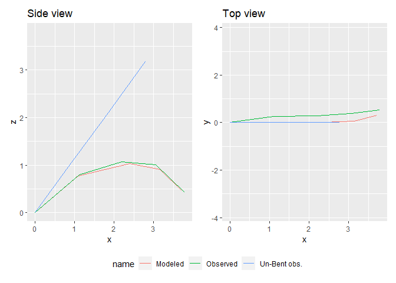
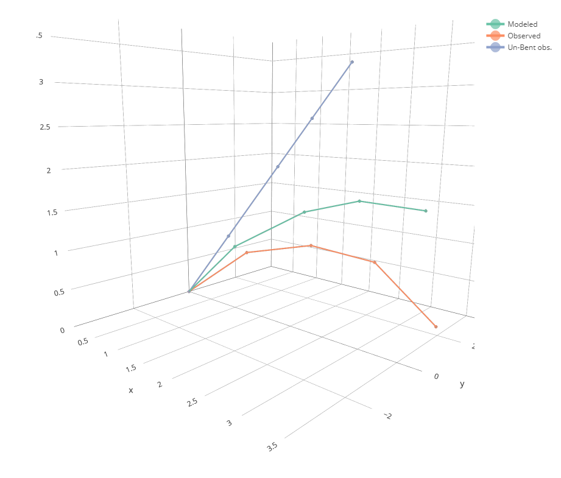

<!-- README.md is generated from README.Rmd. Please edit that file -->

# biomech

<!-- badges: start -->

[](https://github.com/PalmStudio/biomech/actions)
<!-- badges: end -->

`biomech` helps to compute bending and torsion of beams following the
Euler-Bernoulli beam theory. It is specifically designed to be applied
on tree branches (or e.g. palm leaves), but can be applyied to any other
beam-shaped structure.

## Installation

You can install biomech from [GitHub](https://github.com/) with:

``` r
# install.packages("devtools")
devtools::install_github("PalmStudio/biomech")
```

## Example

Here is an example usage:

``` r
library(biomech)
filepath = system.file("extdata/6_EW01.22_17_kanan.txt", package = "biomech")
# Un-bending the field measurements:
df = unbend(2000,400, read_mat(filepath))
# (Re-)computing the deformation:
df_bend = bend(df, step = 0.02, points = 100, iterations = 15, verbose = TRUE)
#>  Final torsion angle at the tip (degree) =  12.52822

df_bend
#>          x            y         z    length  angle_xy    angle_xz   torsion
#> 1 0.000000 0.000000e+00 0.0000000 0.0000000  0.000000 0.000000000  4.000000
#> 2 1.005821 2.560607e-05 0.8804207 1.3367185 41.196484 0.001458629  4.032577
#> 3 2.189133 1.221958e-03 1.5040225 1.3375757 27.789072 0.057927116  4.680782
#> 4 2.938415 1.010048e-02 1.7168802 0.7789798 15.857866 0.678887946  7.234918
#> 5 3.694703 5.296550e-02 1.6982406 0.7577320 -1.409568 3.243945798 12.528219
```

You can plot the results using:

``` r
plot_bending(bent = df_bend, unbent = df)
```



Note that the `unbent` argument is optional but can be very usefull to
compare with the initial conditions.

You can even make 3d plots using `plot_bent_3d()`:

``` r
plot_bending_3d(df_bend,df)
```


